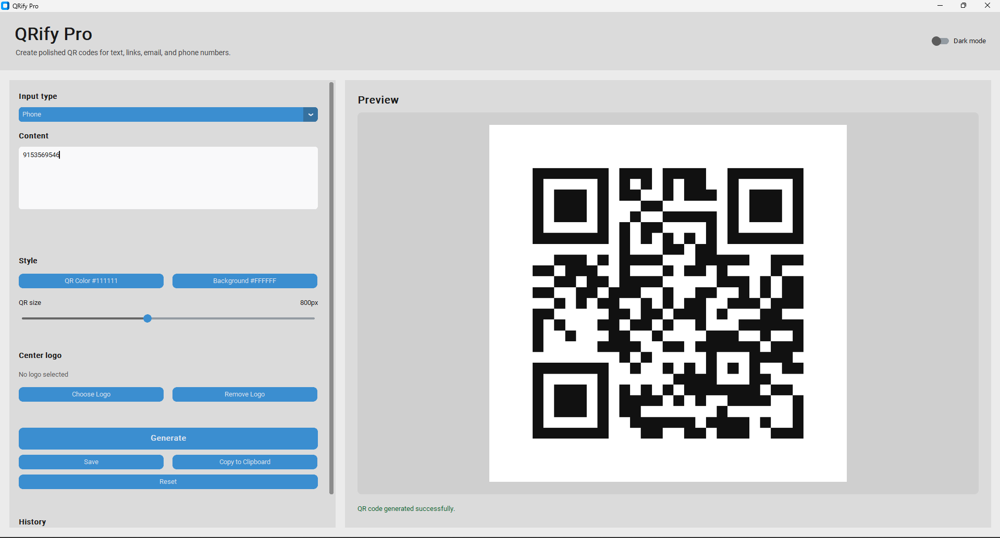
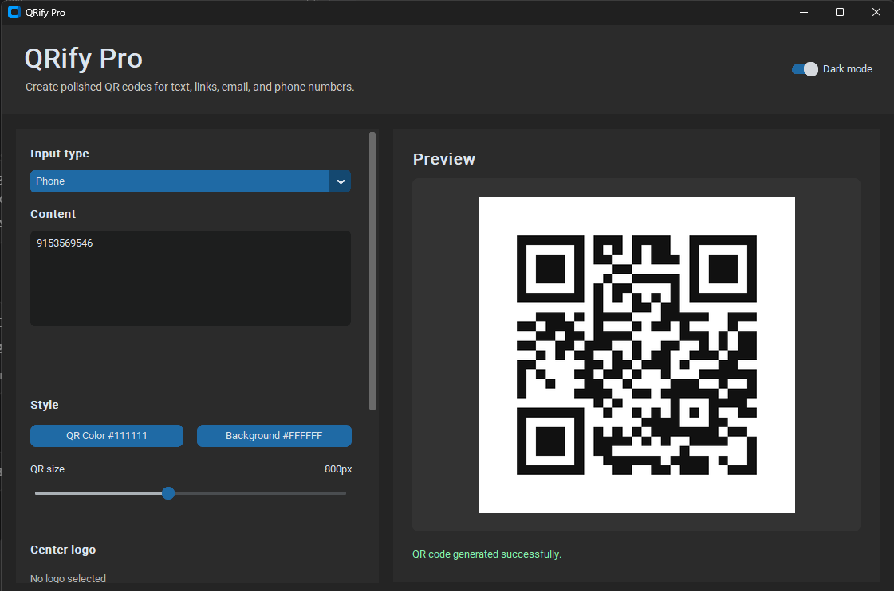

# QRify Pro

QRify Pro is a modern Python desktop application for generating polished QR codes from text, URLs, email addresses, and phone numbers. It includes live preview, color customization, logo embedding, save/export options, clipboard support, dark mode, and a small generation history.

## Features

- Generate QR codes from:
  - Text
  - URLs
  - Email addresses
  - Phone numbers
- Customize QR appearance:
  - QR foreground color
  - Background color
  - QR image size
- Add an optional logo or image at the center of the QR code
- Preview generated QR codes inside the app
- Save QR codes as PNG, JPG, or JPEG
- Copy generated QR codes to the clipboard
- Toggle between light mode and dark mode
- View and reuse the last 5 generated QR codes
- Auto-detect URL, email, and phone-style input suggestions
- Reset all fields quickly
- Built-in validation and error handling
- Automatic local dependency installation on first run

## Tech Stack

- Python 3
- CustomTkinter
- Tkinter
- qrcode
- Pillow

## Project Structure

```text
QRify Pro/
├── main.py
├── utils.py
├── assets/
│   └── .gitkeep
└── README.md
```

## Requirements

You need Python 3 installed on your system.

The app automatically checks for missing dependencies and installs them locally into a `.deps` folder on first run:

- `qrcode[pil]`
- `pillow`
- `customtkinter`

This keeps the project easy to run without requiring a manual global Python setup.

## Installation

Clone the repository:

```bash
git clone https://github.com/Arkadipttv/qrify-pro.git
cd qrify-pro
```

Run the app:

```bash
python main.py
```

On Windows, you may need:

```bash
py main.py
```

## Manual Dependency Installation

If you prefer installing dependencies yourself, run:

```bash
python -m pip install qrcode[pil] pillow customtkinter
```

Then start the app:

```bash
python main.py
```

## How to Use

1. Open the app with `python main.py`.
2. Choose the input type: Text, URL, Email, or Phone.
3. Enter your content.
4. Select QR color, background color, and size.
5. Optionally choose a center logo.
6. Click **Generate** to preview the QR code.
7. Click **Save** to export it as PNG or JPG.
8. Click **Copy to Clipboard** to copy the generated QR code or QR content.
9. Use **Reset** to clear the form and start again.

## Supported Input Formats

### Text

Any non-empty text can be converted into a QR code.

### URL

Examples:

```text
https://example.com
example.com
```

If a URL does not include `http://` or `https://`, QRify Pro automatically adds `https://` to the QR payload.

### Email

Example:

```text
hello@example.com
```

Email QR codes are generated using the `mailto:` format.

### Phone

Examples:

```text
+1 555 123 4567
555-123-4567
```

Phone QR codes are generated using the `tel:` format.

## 📸 Screenshots

### 🌞 Light Mode


### 🌙 Dark Mode


## Notes

- Generated QR codes use high error correction so they can still scan reliably when a center logo is added.
- Large logos may reduce QR scan reliability. For best results, use a simple square logo with a transparent or plain background.
- The `.deps` folder is created automatically when dependencies are installed locally.

## Recommended `.gitignore`

For GitHub, add a `.gitignore` file with:

```gitignore
__pycache__/
*.pyc
.deps/
test_outputs/
.venv/
venv/
env/
*.log
```

## License

This project is open for personal and educational use. Add your preferred license before publishing if you want others to reuse or modify it.

## Author

Made with Python by **Arkadip Ray**.
